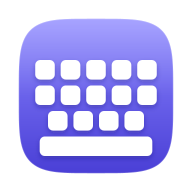

  

<h1 align="center">LiBoard</h1>

  <b>Eine Android-Tastatur im Stil der iPhone-Tastatur – offline, privat, quelloffen.</b> 
  Version 0.1.0 Beta · aufgebaut auf <a href="https://github.com/HeliBorg/HeliBoard">HeliBoard</a> · GPL-3.0 
  <a href="https://lisoft.goip.de/liboard/">lisoft.goip.de/liboard</a>

## Idee

Wer vom iPhone zu Android wechselt, vermisst oft die Tastatur: ruhige Tasten, klare Sondertasten,
viele Varianten beim langen Drücken, die Leertaste als Trackpad. LiBoard bringt dieses Gefühl auf
Android – ohne Konto, ohne Cloud und ohne Internetberechtigung.

## Funktionen (Auswahl)

- **Aussehen nach Apple HIG:** iOS-Proportionen, helle und dunkle Variante, Umriss-Shift, Aktionstaste mit Text
- **123- und #+=-Seite wie auf dem iPhone**, Varianten beim langen Drücken nach deutschem iOS-Vorbild
- **Leertaste lang drücken = Trackpad:** Cursor frei und zeilenweise bewegen
- **Kein Leerstreifen** unter der Tastatur, **„Fertig“** zum Ausblenden
- **Hoch-/Tiefstellen** (x² / x₂) für Formeln: H₂O, SO₄²⁻, x²
- **Deutsch und Englisch gleichzeitig** ohne Umschalten
- **Emoji-Ansicht** mit Suche und Kategorien; wahlweise System-Emojis oder eine selbst geladene Emoji-Schrift
- **Tipp-Test:** Fehlerquote, Korrekturen und Tempo messen – nur auf dem Gerät gespeichert
- **Einstellungen nach Apple HIG**

## Datenschutz

LiBoard hat **keine Internetberechtigung** – technisch kann die Tastatur nichts senden. Die
(freiwillige) Gestendaten-Sammlung von HeliBoard ist entfernt. Wörterbücher, Lernen und Tipp-Test
bleiben auf dem Gerät.

## Installation

- **F-Droid:** Paketquelle `https://volkskamera.goip.de/fdroid/repo` hinzufügen (Anleitung und QR-Code auf
  [lisoft.goip.de/liboard](https://lisoft.goip.de/liboard/)) – dann kommen Updates automatisch.
- **APK:** unter [Releases](https://github.com/veritasX1/LiBoard/releases) oder auf der Homepage.

Danach: Einstellungen → System → Tastatur → LiBoard aktivieren.

## Herkunft und Lizenz

LiBoard ist ein Fork von **[HeliBoard](https://github.com/HeliBorg/HeliBoard)** (Helium314 und
Mitwirkende), das wiederum auf OpenBoard und der AOSP-Tastatur aufbaut. Ohne diese Arbeit gäbe es
LiBoard nicht – danke! Das ursprüngliche README liegt unter
[docs/HELIBOARD-README.md](docs/HELIBOARD-README.md).

Lizenz: **GNU General Public License v3.0** (siehe [LICENSE](LICENSE)). Einzelne Teile stehen unter
weiteren freien Lizenzen, wie in HeliBoard angegeben.

LiBoard ist ein privates, nichtkommerzielles Projekt von Olaf Winkler und steht in keiner Verbindung
zu Apple Inc. „iPhone“ ist eine Marke von Apple Inc. Es werden keine Grafiken oder Schriften von Apple
mitgeliefert.
